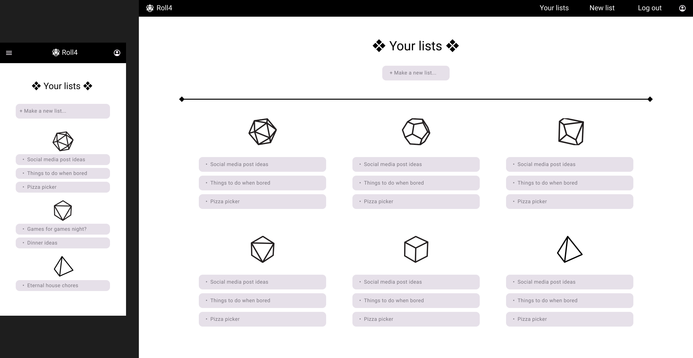

# Roll4

["Roll4"](https://shirral.github.io/Roll4/) is a simple tool meant to make everyday decisionmaking easier and more fun. Need a hand deciding what to watch at a movie night? Deciding what kind of pizza to order? Or which chores to tackle first? Roll4 has you covered.

Inspired by the decision wheels and by the RPG dice, both of which can be used to determine an option among a set of options at random, Roll4 allows the user to create lists where every option corresponds to a number on one of the dice's side. The user can then either roll a physical die and compare the number with the position on their list, or use the built-in virtual die roll functionality, which will also highlight the rolled option for them.

Roll4 also supports Task Mode for the lists where the list items should be possible to tick off the list, and not be rolled again.

## User Experience & User Interface (UX/UI)

### Site goals

The goal of the site is to provide the user with a handy tool to aid their decisionmaking in the situations where they're faced with many different options to choose from. Some of us are indecisive creatures - that's okay, this is why Roll4 was built! - and some of us just like the fun of letting fate guide their decisions. The lists created by the user are meant to be reused - they won't go away the next time the user opens the app; and the state of completion of the lists in Task Mode will be saved, too.

### User stories

**First time visitor goals:**

* As a first time visitor, I want to learn what the app is about.
* As a first time visitor, I want to create an account.
* As a first time visitor, I want to create my first list.
* As a first time visitor, I want to create some categories for my lists.

**Returning visitor goals:**

* As a returning visitor, I want to log in to my account.
* As a returning visitor, I want to use my lists.
* As a returning visitor, I want to edit and/or delete my lists.
* As a returning visitor, I want to edit and/or delete my categories.
* As a returning visitor, I want to try the Task Mode to use my list for one-off tasks that should be completed once and for all.

### Design

**Colour scheme**

The colour scheme of the app focuses three main colours from the Materialize framework's palette: grey, deep orange, and white. In addition to that, the lightest variant of brown (#efebe9) has been used for the background of the main screens of the app. The full colour palette:

The app also features a dark theme which can be toggledd off/on in the user profile settings. It inverts most colours, using a dark grey background and a white font; the deep orange text has been made lighter. The colour palette for the dark mode:

The home page, login and register screens, as well as the error screens also use the dark palette, with a dark grey background, white text, and deep orange accents:

The users are able to choose a colour for each of the categories they create to tell the lists belonging to them more easily. Twelve colours (11 from the Materialize's colour palette, one custom) have been picked for this purpose:

**Typography**

The website features two fonts:

* **Lilita One** - a fun, energetic, bold font sans-serif used for the h1 headings, the logo, the name inputs, and the buttons, 
* **Comfortaa** - an easy to read, friendly sans-serif font used for any other text.

Both fonts are served by Google Fonts. Impact has been provided as a fallback font for Lilita One, as it's also a big, loud, bold typeface. The browser has been instructed to use its default sans-serif font as a fallback for Comfortaa as it's not as important for the reception of the project as Lilita One and, frankly, all the web safe sans-serif fonts look equally dull anyway.

**Imagery**

The visual goal for the project is to keep it simple and clean. The imagery is minimalistic, with simple icons, where needed, and black and white line pictures of the dice.

**Wireframes**

The wireframes made in the planning stage of the project work have guided me later on. Although the final version of the project does not look exactly the same as what I initially had in mind - I ended up liking the final outcome better - many elements stayed the same: the colours of the login screen, the layout of the elements, the style of the buttons, and the navbar. The wireframes have been prepared with Figma.

## Features

### Responsive design

The website responds to a wide variety of screen sizes. The Materialize framework handles the most breakpoints automatically, but a few elements have been given their own media queries to determine which version of the layout is shown to the user.

### Flash messages

All of the pages except for the **Homepage** and the **Not logged in page** have a dedicated section at the top of the page for displaying flash messages. The messages are used to greet the user after they register or log in, bid them goodbye when they log out or delete their profile, and confirm the successful execution of operations such as adding, editing, or deleting a list or a category.

### Navbar

The Materialize navbar is present on all the main pages extended from base.html - the standard pages the user sees after they log in. It provides the user with a quick access to all the main functionalities of the app. The logo, shown on the left on larger screens and in the middle on the smaller screens, is a link leading the user to the **Lists** page. On the very right of the navbar there is a user icon, taking the user to their profile settings. The standard links are displayed on the right side on the bigger screens and in the side menu shown after tapping on the burger icon, displayed on the left of the navbar on smaller screens.

### Homepage

The simple homepage provides basic information about the application and how to use it. It invites the user to give it a try and presents them with links to **Login** and **Register** pages.

### Login/Register/Not logged in pages

The Login page, Register page, and Not logged in page follow the same simple design. The **Not logged in** page shows up whenever the user is trying to access a page they need to be logged in to see (any pages other than the Homepage, Login/Register pages, and the error pages). It informs the user that they need to be logged in to view the page and prompts them to log in with a big button. 

Log in and Register pages feature a form with two input elements - one for the username, the other for password - and a submit button. The forms are connected to a PostgreSQL database where the user data is being stored. The passwords are hashed with Werkzeug.
There is also a link to the Register page on the Login page and a link to the Login page on the Register page in case a registered user accidentally ends up at the Register page, or an unregister user is brought to a Login page.

### Error pages

The Error 404 and Error 500 pages follow the same simple design. They name the error, provide a brief description to the user, and suggest them an action to take - either going back to an existing page (Lists) in case of error 404, or trying to access the page again at a later time in case of error 500. They both offer the button with a link to help the user take that action. The button on the error 500 page brings the user to the page they were trying to access earlier.

### Lists page

The lists page is the main viewpoint of the app. This is where all of the lists created by the logged in user can be seen. The list information is pulled from a MondoDB database.

* **New list button:** Positioned above all of the existing list, the button provides the user with a quick access to creating a new list. It leads to the **New list** page.

* **List display section:** Below the new list button, all of the lists created by the user are displayed in the form of cards. They are grouped by the die associated with them. Each die section is only going to be displayed if there is at least one list of its kind in them - empty sections will be hidden.

If the lists are given categories, they will be dosplayed on the cards on the very right of them. Lists without a category assigned to them will display [None] as their category. If the category assigned to a list has been assigned a colour, the card will be of that colour.
After clicking on a card, the user will be taken to its **List view** page.

### New list page

The New list page utilizes Materialize's grid system to align dice on the page. Here, the user picks the die that will determine the number of items in their list. Each option is represented with a picture of the die in question, its name, and a short description of what it represents. Clicking on each die (or their name, or description) leads the user to the **Add list** page of that specific type.

### List view page

This is where the user can access the details of their list. The list information is pulled from a MondoDB database.

* **List name:** Displays the name given to the list by the user on the top of the page.

* **List item cards:** Each list item is displayed in a card accompanied by its associated number and a notes icon. The icon is only shown on the list items that have any notes added to them. If they do, the list item card can be clicked on for the notes to be shown. Clicking on a card that does not have any notes attached to it does not do anything. The cards are animated on hover, inviting the user to click them.

* **Roll die functionality:** Allows the user to pick a random item from the list. The number rolled will be shown underneath the "DIE ROLL!" section and the corresponding card will be highlighted.

* **Task mode functionality:** Turns the list into a one-off-tasks kind of an affair. After turning the toggle on, every list item can only be rolled once; the items which have been rolled previously will become greyed out. The list refreshes once all of the list items have been rolled, or if the user turns task mode off and on again.

* **Back, edit list, delete list buttons:** Let the user navigate to: Lists page, List edit page for the current list, and a modal confirming list deletion, respectively.

* **List delete modal:** Asks the user if they are sure they want to delete the list. Shown when the user clicks on the "delete list" button; hidden when the user clicks away from it or chooses one of the options. When list deletion is chosen, the list gets deleted from the database.

### Add/edit list pages

The add/edit list pages look nearly identical. When creating a new list, all of the fields are empty; the placeholder is shown in the input field for the list name. In the edit list page, the information already submitted by the user will be shown; the fields will be pre-populated with the information about the list saved in the database.

* **List name:** Allows the user to name their list. The field is mandatory.

* **Add/change category:** Clicking on the paragraph shows a dropdown menu where a category can be added to the list. Adding a category is optional.

* **List item input fields:** This is where all of the options to choose from go. Each of them will have a specific number assigned to it - these are shown on the left.

On the right of the text field, there is a button allowing the user to add/edit notes. When the button is hovered over, a Materialize tooltip appears, explaining the function of the button. When it is clicked, a text ares appears below the chosen list item input where notes about the list item can be added or edited.

* **Cancel and save list/save changes buttons:** The cancel button on the Add list page brings the user back to the Lists page. The cancel button on the Edit list page brings them back to the List view page. The save list/save changes buttons send the information submitted by the user to the database.

### Categories page

This is where all of the categories created by the user are displayed on the cards. The cards will have a colour associated with the category or remain white if no colour has been chosen. The cards are animated on hover, inviting the user to click them. Clicking on a category card will bring the user to the **Edit category** page for that category. Like the List viee page, the Categories page also has a button allowing the user to create a new category positioned above the existing categories.

### Add/edit category pages

The add/edit category pages look nearly identical. When creating a new category, all of the fields are empty; the placeholder is shown in the input field for the category name. In the edit category page, the information already submitted by the user will be shown; the name field and colour choice will be pre-populated with the information about the category saved in the database.

* **Category name iput:** A text field allowing the user to name the category.

* **Colour picker:** Allows the user to pick the colour associated with their category. The colourful circles are styled custom radio buttons.

* **Cancel, add category/save changes, and delete category buttons:** The cancel button returns the user to the categories page without saving anything to the database. The add category/save changed button saves the information about the category to the database, and then returns the user back to the Categories page. The delete category button brings up a selete category modal.

* **Category delete modal:** Asks the user if they are sure they want to delete the category. Shown when the user clicks on the "delete category" button; hidden when the user clicks away from it or chooses one of the options. When category deletion is chosen, the category gets deleted from the database.

### User profile page

The profile page is very simple. It greets the user, allows them to turn dark mode on and off, and to delete their account.

* **User greeting:** The app pulls the user's userame from the database to deliver a personalised greeting.

* **Dark mode toggle:** Allows the user to turn the dark mode on/off. The dark mode inverses the colour scheme of the main section of the app pages, providing ligh-coloured text, icons, and images on a dark background.

Comparison of light mode vs. dark mode:

* **Account deletion:** The user can also delete their profile. Clicking on the "Delete profile" link brings up a modal asking the user for confirmation. It works just like the other modals. 

### Future features

Although the project is a simple one and it's meant to stay that way not to overwhelm the user with all the options and choices - in the end, it's an app meant to make the decisionmaking process easier - there are some fetures that might be nice to add in the future:

* **List sharing:** It would be nice to be able to share your lists with other users. It could be achieved by the target user providing the user sharing the list with a unique code generated for them by the application; the other user could then input the code as well as the other user's username as a safety feature preventing users to randomly sending unsolicited lists to others.

* **Custom die and a quick coin flip:** Although these are technically not dice anymore, it would be good to give users the option to create lists with a custom amount of items as well as an option of a quick "coin flip" - a random pick of one of the two items. It would extend the functionality and real-life applications of the app.

* **Improving the list card display on the List page on mobile devices:** For the lists with long names, or items with long category names - or both! - it would be good to change the way both of these are displayed on the cards to improve the cleanliness of the design and the readability.

* **Adding a die roll animation:** Seeing the tumbling die before getting the result would be more fun and engaging for the user.

* **Allowing the user to change them their username and password, and to provide a recovery email address which could be used to recover forgotten password.**

* **Adding search and sort functionalities** to give the user more control over their lists, especially if they have a lot of them.

## Testing

For information about testing, please refer to **[TESTING.md](TESTING.md)**.

## Technologies and Resources used

### Programming languages used:

* **HTML5**
* **CSS3**
* **JavaScript**
* **Python**

### Database management systems used:

* **[PostgreSQL](https://www.postgresql.org/)**
* **[MongoDB](https://www.mongodb.com/)**

### Frameworks & Libraries Used:

* **[Flask](https://flask.palletsprojects.com/en/3.0.x/)**
* **[jQuery](https://jquery.com/)**
* **[Materialize](https://materializecss.com/)**
* **[Google Fonts](https://fonts.google.com/)**
* **[Material Icons](https://developers.google.com/fonts/docs/material_icons)**

### Software & other technologies used:

* **[Visual Studio Code(https://code.visualstudio.com/)]** - IDE the project was written in. Used with the **[HTML Boilerplate](https://marketplace.visualstudio.com/items?itemName=sidthesloth.html5-boilerplate)**, **[Pylance](https://marketplace.visualstudio.com/items?itemName=ms-python.vscode-pylance)**, **[MongoDB for VS Code](https://marketplace.visualstudio.com/items?itemName=mongodb.mongodb-vscode)**, **[PostgreSQL](https://marketplace.visualstudio.com/items?itemName=ms-ossdata.vscode-postgresql)**, **[Python](https://marketplace.visualstudio.com/items?itemName=ms-python.python)**, **[Python Debugger](https://marketplace.visualstudio.com/items?itemName=ms-python.debugpy)** and **[IntelliSense for CSS class names in HTML](https://marketplace.visualstudio.com/items?itemName=Zignd.html-css-class-completion)** extensions.
* **[GitHub Desktop](https://github.com/apps/desktop)** - used for version control and pushing commits to GitHub.
* **[MongoDB Atlas](https://www.mongodb.com/products/platform/atlas-database)** - used to control the contents of and the connection to the MongoDB database.
* **[PostgreSQL server and pgAdmin4](https://www.postgresql.org/download/windows/)** - used to control the contents of and the connection to the PostgreSQL database.
* **[Canva](https://www.canva.com/)** - used to get the mockup base.
* **[Photopea](https://www.photopea.com/)** - used to prepare the images for the readme file.
* **[Figma](https://www.figma.com/)** - used to create the wireframes.
* **[Ezgif](https://ezgif.com/maker)** - used to convert video files into gif files for the readme file.
* **[Snipping Tool](https://apps.microsoft.com/detail/9mz95kl8mr0l?hl=en-US&gl=US)** - used to take screenshots and for the screen recording to create the animated gifs for the readme file.

### How-to references used:

* [querying the db with sqlalchemy](https://flask-sqlalchemy.palletsprojects.com/en/2.x/queries/)
* [using -range- with Jinja](https://stackoverflow.com/questions/17691838/range-in-jinja2-inside-a-for-loop)
* [using -defaults- with Flask routes to solve problems with generic adresses being accessed by the user without the expected variable](https://www.learninbits.com/flask-routing-tricks-using-default-values-for-dynamic-urls/)
* [using request.form.getitems to get an entire list/dictionary of similar items from a form](https://stackoverflow.com/questions/58160006/how-to-get-multiple-elements-from-a-form-using-request-form-get)
* [converting 'int' to 'string' with Jinja](https://stackoverflow.com/questions/35644954/jinja2-converting-int-to-string-inside-html)
* [cards css](https://css-tricks.com/block-links-the-search-for-a-perfect-solution/)
* [using logic operators in Jinja](https://stackoverflow.com/questions/41873717/how-to-use-logic-operators-in-jinja-template-on-salt-stack-and-or)
* [submitting a checkbox without using a submit button](https://stackoverflow.com/questions/33393852/is-it-possible-to-submit-a-checkbox-form-without-submit-button-in-php)
* [checking if a checkbox is checked with JS](https://stackoverflow.com/questions/9887360/how-can-i-check-if-a-checkbox-is-checked)
* [creating custom radio buttons](https://www.w3schools.com/howto/howto_css_custom_checkbox.asp)
* [using -set- with Jinja](https://jinja.palletsprojects.com/en/3.1.x/templates/#assignments)
* [changing arrow colour in Materialize's select element](https://stackoverflow.com/questions/60914431/)
* [changing colour of Materialize's switch element](https://codepen.io/Nohinn/pen/xONgLv)
* [using fetch() with flask](https://flask.palletsprojects.com/en/3.0.x/patterns/javascript/) and [also this](https://rahulbaran.hashnode.dev/how-to-send-json-from-javascript-to-flask-using-fetch-api)

### Project guidance & assistance:

* **My Mentor, Mitko Bachvarov** - thank you for your feedback and guidance!
* **My friend Luís** - thank you for the troubleshooting help with the project setup!
* **The loveliest Azul** - thank you for the troubleshooting help, reminding me to take things step by step, and for all moral support when things were not working and I was about to give up!