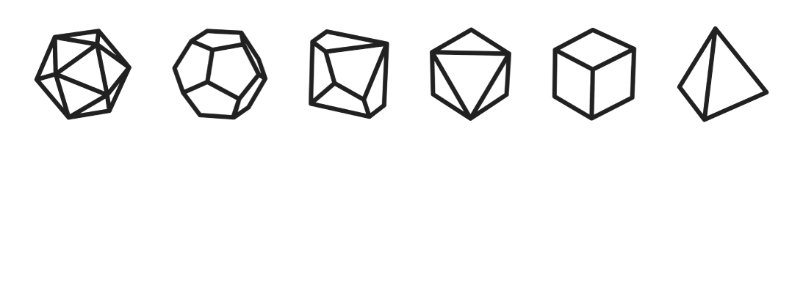

# Roll4

["Roll4"](https://shirral.github.io/Roll4/) is a simple tool meant to make everyday decisionmaking easier and more fun. Need a hand deciding what to watch at a movie night? Deciding what kind of pizza to order? Or which chores to tackle first? Roll4 has you covered.

Inspired by the decision wheels and by the RPG dice, both of which can be used to determine an option among a set of options at random, Roll4 allows the user to create lists where every option corresponds to a number on one of the dice's side. The user can then either roll a physical die and compare the number with the position on their list, or use the built-in virtual die roll functionality, which will also highlight the rolled option for them.

Roll4 also supports Task Mode for the lists where the list items should be possible to tick off the list, and not be rolled again.

## User Experience & User Interface (UX/UI)

### Site goals

The goal of the site is to provide the user with a handy tool to aid their decisionmaking in the situations where they're faced with many different options to choose from. Some of us are indecisive creatures - that's okay, this is why Roll4 was built! - and some of us just like the fun of letting fate guide their decisions. The lists created by the user are meant to be reused - they won't go away the next time the user opens the app; and the state of completion of the lists in Task Mode will be saved, too.

### User stories

**First time visitor goals:**

* As a first time visitor, I want to learn what the app is about.
* As a first time visitor, I want to create an account.
* As a first time visitor, I want to create my first list.
* As a first time visitor, I want to create some categories for my lists.

**Returning visitor goals:**

* As a returning visitor, I want to log in to my account.
* As a returning visitor, I want to use my lists.
* As a returning visitor, I want to edit and/or delete my lists.
* As a returning visitor, I want to edit and/or delete my categories.
* As a returning visitor, I want to try the Task Mode to use my list for one-off tasks that should be completed once and for all.

### Design

**Colour scheme**

The colour scheme of the app focuses three main colours from the Materialize framework's palette: grey, deep orange, and white. In addition to that, the lightest variant of brown (#efebe9) has been used for the background of the main screens of the app. The full colour palette:

The app also features a dark theme which can be toggledd off/on in the user profile settings. It inverts most colours, using a dark grey background and a white font; the deep orange text has been made lighter. The colour palette for the dark mode:

The home page, login and register screens, as well as the error screens also use the dark palette, with a dark grey background, white text, and deep orange accents:

The users are able to choose a colour for each of the categories they create to tell the lists belonging to them more easily. Twelve colours (11 from the Materialize's colour palette, one custom) have been picked for this purpose:

**Typography**

The website features two fonts:

* **Lilita One** - a fun, energetic, bold font sans-serif used for the h1 headings, the logo, the name inputs, and the buttons, 
* **Comfortaa** - an easy to read, friendly sans-serif font used for any other text.

Both fonts are served by Google Fonts. Impact has been provided as a fallback font for Lilita One, as it's also a big, loud, bold typeface. The browser has been instructed to use its default sans-serif font as a fallback for Comfortaa as it's not as important for the reception of the project as Lilita One and, frankly, all the web safe sans-serif fonts look equally dull anyway.

**Imagery**

The visual goal for the project is to keep it simple and clean. The imagery is minimalistic, with simple icons, where needed, and black and white line pictures of the dice.

**Wireframes**

The wireframes made in the planning stage of the project work have guided me later on. Although the final version of the project does not look exactly the same as what I initially had in mind - I ended up liking the final outcome better - many elements stayed the same: the colours of the login screen, the layout of the elements, the style of the buttons, and the navbar. The wireframes have been prepared with Figma.

## Features

### Responsive design

The website responds to a wide variety of screen sizes. The Materialize framework handles the most breakpoints automatically, but a few elements have been given their own media queries to determine which version of the layout is shown to the user.

### Homepage

### Login/Register pages
